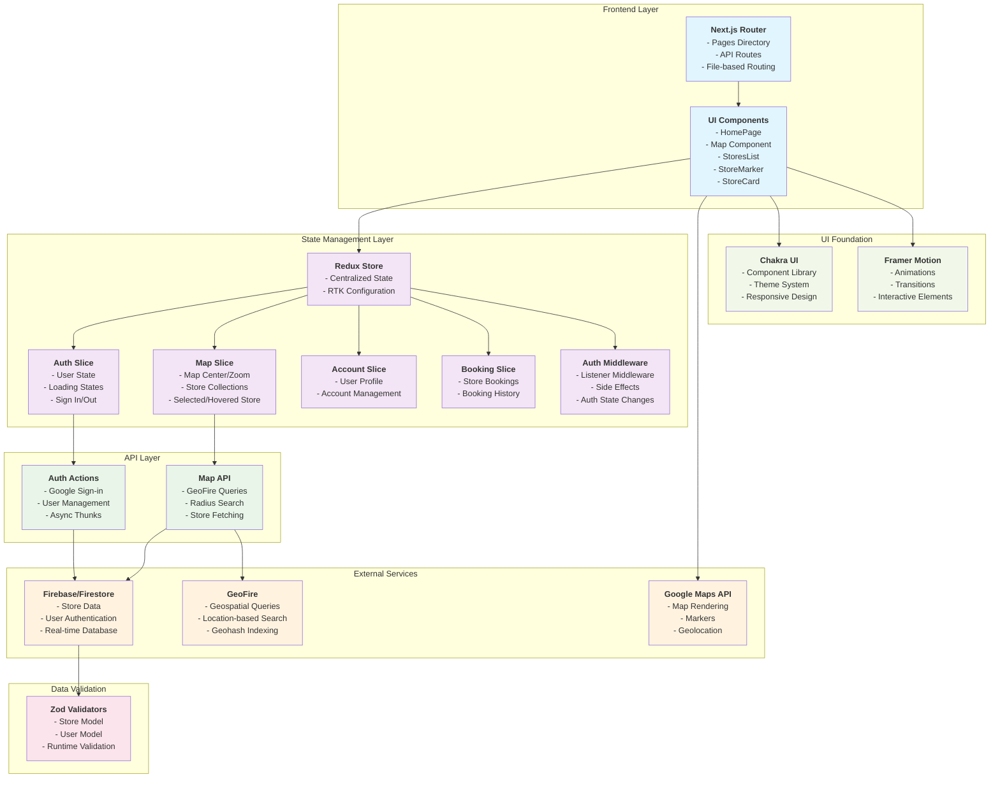

# Sanify - Multi-Tenant Store Locator Application for B2B2C SaaS

This is a modern **store locator application** built with Next.js and TypeScript that allows users to discover and interact with stores on an interactive Google Map. The application features real-time geospatial queries, user authentication, and a responsive UI built with a robust state management architecture.

## Architecture Diagram



## Technical Stack

### Core Technologies
- **Framework**: Next.js 13.4.19 with TypeScript
- **Runtime**: React 18.2.0
- **State Management**: Redux Toolkit + React Redux
- **UI Library**: Chakra UI with custom theming
- **Styling**: Emotion + CSS-in-JS
- **Package Manager**: pnpm

### Key Dependencies
- **Maps**: `@react-google-maps/api` for Google Maps integration
- **Geospatial**: `geofire-common` for location-based queries
- **Database**: Firebase/Firestore for data persistence
- **Validation**: Zod for runtime type safety
- **Animations**: Framer Motion for smooth transitions
- **Utilities**: `usehooks-ts` for custom React hooks

## State Management Architecture

### Redux Store Structure
```typescript
interface RootState {
  auth: AuthState;      // User authentication & profile
  map: MapState;        // Map state & store data
  account: AccountState; // User account management
  booking: BookingState; // Store booking functionality
}
```

### Feature-Based Slice Pattern
Each feature is organized as a self-contained slice with:
- **State Definition**: TypeScript interfaces for type safety
- **Reducers**: Pure functions for state mutations
- **Actions**: Both sync and async (thunks) actions
- **Selectors**: Custom hooks for component access

### Key State Management Features

#### 1. **Map State Management**
```typescript
interface MapState {
  center?: google.maps.LatLngLiteral;  // Map center coordinates
  zoom?: number;                       // Current zoom level
  loading: boolean;                    // Loading state
  stores?: Store[];                    // Array of nearby stores
  selectedStore?: Store;               // Currently selected store
  hoveredStore?: Store;                // Currently hovered store
}
```

#### 2. **Geospatial Query Flow**
1. **Initial Load**: `fetchStoresInRadius(30000)` dispatched on HomePage mount
2. **GeoFire Integration**: Uses geohash queries for efficient radius searches
3. **State Updates**: Async thunk updates map slice with fetched stores
4. **Reactive Rendering**: Components automatically re-render on state changes

#### 3. **Authentication Middleware**
- **Listener Middleware**: Monitors auth state changes
- **Side Effects**: Automatically fetches user bookings on login
- **Async Operations**: Handles sign-in/sign-out flows

## Component Architecture

### Page-Level Components
- **HomePage**: Main application view with map and store list
- **Layout System**: MainLayout with AuthWrapper for protected routes

### Feature Components
```
src/components/pages/home/widgets/
├── Map.tsx              # Google Maps integration
├── StoresList.tsx       # Scrollable store list
├── StoreMarker.tsx      # Individual map markers
├── StoreCard.tsx        # Store detail cards
└── StoreListTile.tsx    # List item components
```

### Shared Components
```
src/components/global/
├── layouts/             # Layout components
├── widgets/             # Reusable UI widgets
└── wrappers/            # Higher-order components
```

## Data Flow & Interactions

### 1. **Store Discovery Flow**
```
User Location → GeoFire Query → Firebase → Redux Store → UI Update
```

### 2. **Store Selection Flow**
```
User Click → Redux Action → State Update → Map Center + Store Card Display
```

### 3. **Real-time Updates**
- Map center changes trigger re-centering
- Store hover/selection updates visual states
- Loading states provide user feedback

## API Integration

### Firebase/Firestore Structure
```typescript
interface Store {
  name: string;
  description?: string;
  booking_amount?: number;
  logo?: string;
  geo: {
    geohash: string;           // GeoFire geohash
    geopoint: [number, number]; // [latitude, longitude]
  };
  profile_image_uri: string;
  // ... additional fields
}
```

### GeoFire Query Optimization
- **Geohash Indexing**: Efficient spatial queries
- **Bounds Calculation**: Multiple query bounds for accuracy
- **Distance Filtering**: Post-query filtering for precision
- **Batch Operations**: Promise.all for concurrent queries

## Performance Optimizations

### 1. **Code Splitting**
- Suspense boundaries for Map and StoresList
- Dynamic imports for non-critical components

### 2. **State Optimization**
- Immer for immutable state updates
- Memoized selectors to prevent unnecessary re-renders
- Custom hooks for state access patterns

### 3. **Map Performance**
- Custom map styling for performance
- Marker clustering (prepared for scale)
- Lazy loading of map components

## Security & Validation

### 1. **Runtime Type Safety**
- Zod validators for all external data
- Type-safe Firebase document parsing
- Compile-time TypeScript checking

### 2. **Authentication Flow**
- Google OAuth integration
- Protected routes with AuthWrapper
- Secure API key management

## Development Patterns

### 1. **Custom Hooks Pattern**
```typescript
// Typed selectors for Redux state
const useMapSelector = () => useSelector((state: RootState) => state.map);
const useAppDispatch = () => useDispatch<AppDispatch>();
```

### 2. **Configuration Management**
- Centralized theme configuration
- Environment-based API keys
- Reusable constants and utilities

### 3. **Error Handling**
- Toast notifications for user feedback
- Graceful fallbacks for API failures
- Loading states for better UX

## Scalability Considerations

### Current Architecture Benefits
- **Modular Design**: Feature-based organization
- **Type Safety**: Full TypeScript coverage
- **State Predictability**: Redux with immutable updates
- **Component Reusability**: Chakra UI system
- **Performance**: Code splitting and optimization

### Future Scaling Paths
- **Caching**: React Query for server state
- **Real-time**: WebSocket connections for live updates
- **Offline**: Service workers for offline capability
- **Testing**: Jest + Testing Library setup ready

This architecture demonstrates modern React application patterns with a focus on maintainability, type safety, and user experience. The combination of Redux Toolkit, Firebase, and Google Maps creates a robust foundation for location-based applications. 